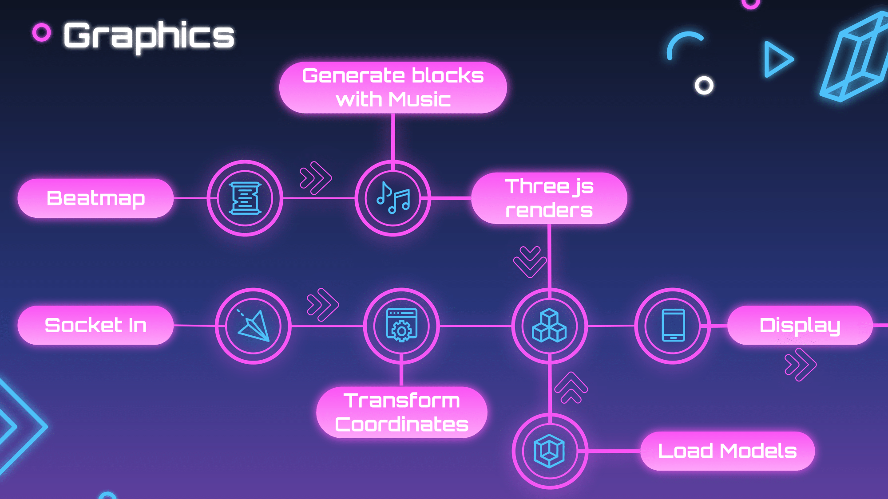

# Beep-Saber
This repo contains the frontend code for this project.
The [repo](https://github.com/marmikupadhyay/beep-saber-server) for the tracking website is [Tracking Website](https://beep-saber.azurewebsites.net/pose) 

## Installation for dev

1. Fork and Clone the repo
2. npm i
3. npm rn start (this will by default connect to the tracking website hosted at heroku)

See presentation to see how all this works.

## Demonstration
[Slides link](https://docs.google.com/presentation/d/10ut7IE0m2fZokO3z-PqLQl87pxm6-LV_cqkDvaBj23Y/edit?usp=sharing)

